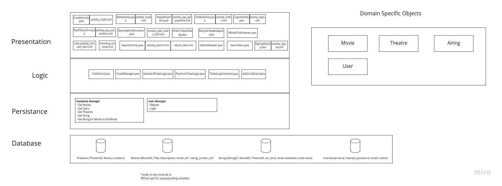

# Group 8
Group 8 is developing a movie ticket purchasing application. The aim of the app is to allow users to be able to purchase and reserve movie tickets through an app before going to the theater.

## Running the SceneIt app. 
1) The first screen visible is the "login page"
2) Please run through the sign-up page by clicking "sign-up", enter a username and password (keep track of these) and return back to the "login page". 
3) Enter the information previously registered, and click "login". There will be a pop up at the bottom of the screen confirming whether the login was successful 
4) There should now be a movie select page, select a movie and theatre by tapping the specific movie and theatre drop down menus. Or alte
5) Proceed to the ordering page, which should display pertinent info to the selecteed movie. Enter the desired date (note: only the "next 30" days from whenever run-time is will have tickets available), showing time and number of tickets (max 10). Once done selecting options, click "Order Tickets" and select a payment method from the dialogue box. 
6) If Credit Card selected: Insert dummy personal info into credit card information, selecting a credit card number from the "Test Credit Card Numbers" below. 
7) If PayPal selected: Click "change" button and insert dummy personal info into credit card information, selecting a credit card number from the "Test Credit Card Numbers" below.
8) Save enter provided data and confirm any required agreements. 
9) End testing here. 

## Test Credit Card Numbers
| Number         |
|----------------|
|4532589041225898|
|4539138697250462|
|4138479754458225|
|4916794038704048|
|4532687506795866|
|4539004635013539|

## Important Document Links
* [Vision](./Vision.md)
* [Branching Strategy](./git.md)
* [Iteration 1 Worksheet](./worksheet-iter1.md)
* [Iteration 2 Worksheet](./worksheet-iter2.md)
* [Iteration 3 Worksheet](./worksheet-iter3.md)
* [Retrospective](./RETROSPECTIVE.md)

## Architecture

