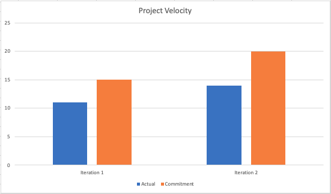

# Retrospective
The development of our movie ticket purchasing application named SceneIt has been a smooth ride. Each member of the team put in a considerable effort in developing the app. We communicated often and divided up the work based on our strengths. In addition, we asked each other questions when we got stuck and delivered on a timely basis.

## Part of the project that has not been as successful as we would have preferred 
Throughout the application development, we had issues in identifying our general architecture design. To elaborate, we had concerns regarding which layer our implementations resided. For instance, at the start of our iteration most of our implementation resided in the presentation layer. 

Another issue we encountered was our user interface would conflict with the database we created. Andriod studio doesn't like running network operations on the main thread. So, following the JIT (just-in-time) approach, we implemented a hack to work for the time being. In addition, we lacked an extensive amount of tests implemented. 

## Concrete ways of improvement and how the success is evaluated 
Regarding our architecture design issue, we improved it by discussing what each of our implementations does to figure out which layer (data, logic or presentation) it resides in. For instance, if we look at `CreditCard.java`, the class doesn’t have a direct relation to the user interface so it wouldn’t be in the presentation layer. Consequently, it doesn’t have a direct relation to the data layer so it would reside in the logic layer. As a result, the success of our improvement can be evaluated by making the maintainability of our system easier for years to come. 

Furthermore, to improve/fix our issue regarding the user interface and database, we found a way to run them on different threads to avoid conflicts. We also implemented proper integration tests to test our application between layers in addition to the unit tests we have. The success of our improvement can be evaluated by removing our hack and running our application without any issues. In addition, the tests we implemented can help us in identifying bugs early on so that we have a working production code. 

## Project velocity
At the start of our iteration, we managed to complete as many features as we can so that we can work on improving our system throughout iteration 2 and 3. In iterations 2 we mainly completed bug fixes and some database improvements as well as introduced some features. And in iteration 3 we added last minute touches and extensive tests for our implementations. In conclusion, good communication, adequate time management and starting off the project rapidly assisted us in completing our application satisfactorily. The picture below shows our commitments versus our actual completed tasks. 

