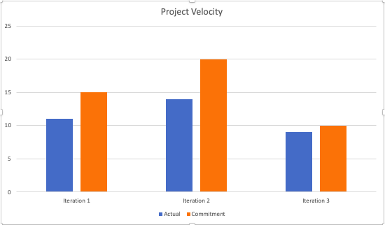

What technical debt has been cleaned up
========================================

The technical debt we paid off is deliberate and prudent. In `MainActivity.java` the trending section did not communicate with the database to retrieve data. Instead, it used hard-coded data to display. Therefore, we fixed that up in this iteration so that we retrieve data from the database, change the order a bit, and display it. This is important for maintainability purposes because we can change the database in the future without affecting the code in the `getTrending()` too much.

[Link to commit](https://code.cs.umanitoba.ca/3350-winter-2021-a02/group-8/app/-/merge_requests/47/diffs?commit_id=ed5f5caee92f575bf7d74a08f0452f1a67c931b0)

What technical debt did you leave?
==================================

The technical debt we left was deliberate and prudent. In `CreditCardManager.java` there is a validateInput class. It has a lot of error messages hard-coded in strings. These error messages should have been stored in the strings.xml. This creates technical debt later on if we ever want to change languages.

Discuss a Feature or User Story that was cut/re-prioritized
============================================

We originally wanted a feature whereby users could select their own seats before purchasing a ticket however, we found that it'll be a tideous task to setup the UI and implement the feature. Following our JIT approach we could not fully implement it in iteration 3. Therefore, we had to re-prioritize it.

[Link to feature](https://code.cs.umanitoba.ca/3350-winter-2021-a02/group-8/app/-/issues/26)

Acceptance test/end-to-end
==========================

One of the tests we wrote was regarding the user story "As a user, I want to browse movies". This test is responsible in checking if a user is able to in fact choose a movie from the main activity which will lead them to the order activity. The manner in which the test avoids being flaky is that it follows the same set of steps (no leaking states) and does not rely on non-deterministic systems. Therefore we avoid the test being flaky. 

[Link](https://code.cs.umanitoba.ca/3350-winter-2021-a02/group-8/app/-/merge_requests/47/diffs?commit_id=7db9f08d1cf7fb39cafd3d7309578bada7693558)

Acceptance test, untestable
===============

We did not run into any significant issues while creating our acceptance test. And we did not come across any scenerio that was impossible or difficult to test. 

Velocity/teamwork
=================

Yes our estimates did get better throughout the course. We got better at dividing the work between our selves and dilivering in a timely manner. By looking at our project velocity for the iterations, one can deduce that our estimates got better with time.

